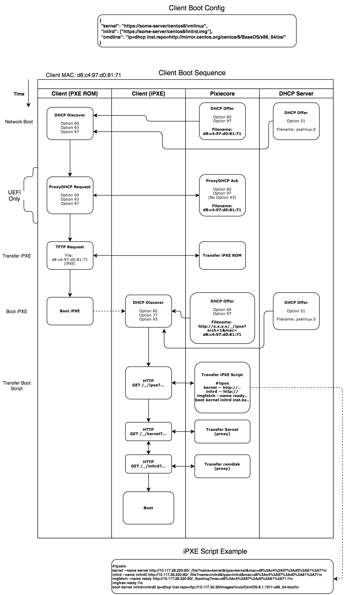

# Overview

Titania is an API driven baremetal provisioning service.

## Getting started 

### Run with `docker-compose`:
The `docker-compose.yml` file will run the server and api API.
1. Run the service:
    ```
    docker-compose up
    ```
2. Navigate to http://localhost:8080 and add a host definition
3. Boot your host

### Run in K8S:
* See [here](./k8s)


### Build the image manually
```
make build-image
```

### Example - Run in Docker with api api
1. Create the stack:
```
docker-compose up
```

2. Add host boot configuration
* Navigate to the swagger page at `http://<host ip>:8080`
* use the create endpoint to create a host config

3. Boot your host from the network


### Example - Run in API Mode, forwarding boot requests to an external server (e.g http://10.117.30.30)

```
docker run -ti --rm --net=host sgryczan/titania-boot:0.1.0 \
    api \
    -d \
    --ipxe-ipxe /ipxe/src/bin/undionly.kpxe \
    --ipxe-efi64 /ipxe/src/bin-x86_64-efi/ipxe.efi \
    --ipxe-bios /ipxe/src/bin/ipxe.pxe \
    http://10.117.30.30
```

### Example - Run in static mode, boot all hosts into CentOS
```
docker run -ti --rm --net=host sgryczan/titania-boot:0.1.0  \
    boot \
    -d \
    /ipxe/boot/vmlinuz \
    /ipxe/boot/initrd.img \
    --ipxe-ipxe /ipxe/src/bin/undionly.kpxe \
    --ipxe-efi32 /ipxe/src/bin-x86_64-efi/ipxe.efi \
    --ipxe-efi64 /ipxe/src/bin-x86_64-efi/ipxe.efi \
    --ipxe-bios /ipxe/src/bin/ipxe.pxe \
    --cmdline "ip=dhcp inst.repo=http://10.117.30.30/images/linux/CentOS-8.1.1911-x86_64-dvd1 inst.ks=https://tengu-boot.s3-us-west-2.amazonaws.com/centos8/centos8.cfg"
```

### Boot Sequence
