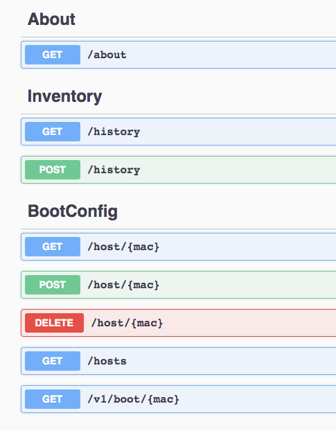

## API Sidecar

## Summary
This is a sidecar container that implements the API spec for pixiecore.



## Getting started

### Build Manually

1. Build the Image
```
make build
```

2. Run the image
```
make run
```

3. Navigate the the API
http://localhost:8080

